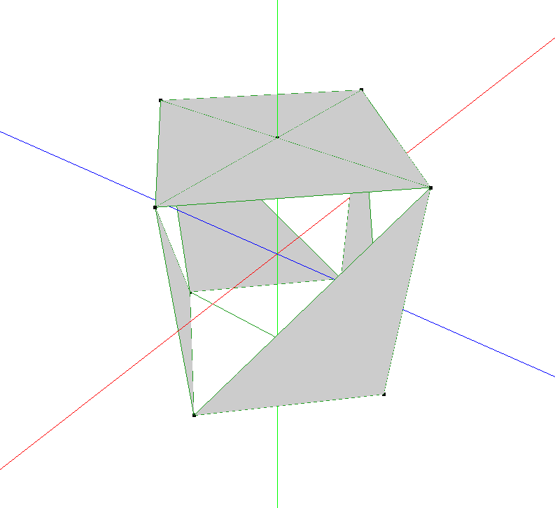
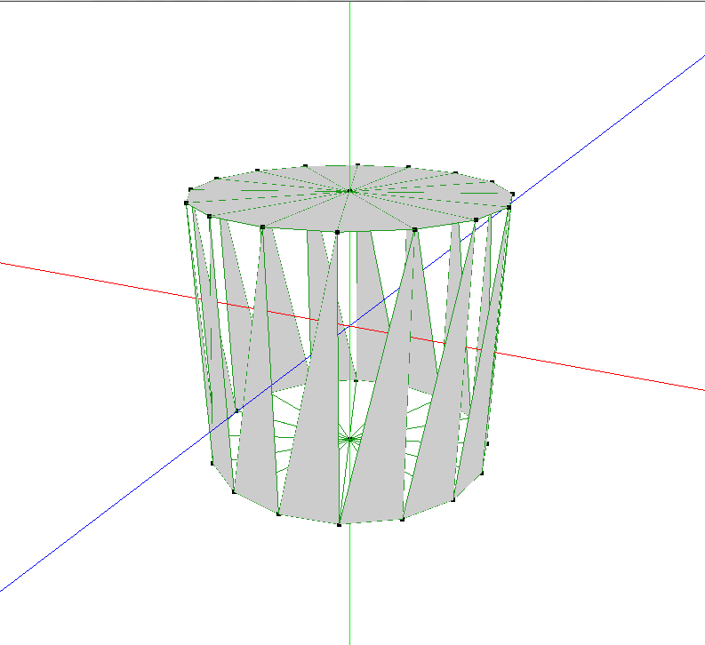
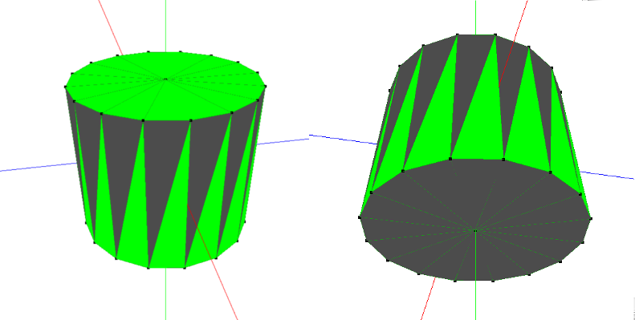

#Practica 2: Objetos por revolución

##Reestructuración del código

Para esta segunda práctica vamos a realizar una reestructuración de las estructuras de datos que hemos usado en la primera práctica. Mientras que en la primera sólo teníamos un tipo de dato abstracto figura ahora vamos a construir una jerarquía de objetos. Primero tendremos figuraSimple que tendrá un vector de vértices y los métodos más simples que nos podamos imaginar como introducir los vértices a mano y la función de visualizar.

De este heredará otro tipo que será figuraSolida que heredará todos los miembros privados pero al que se le añadirá el vector que guarda las caras. Esto implicará que ahora tendremos más métodos, pues tendremos una para indicar las caras y otro para dibujar tanto las aristas que en nuestro caso también vendrán definidas por las caras (otra opción sería tener otro vector de aristas para dibujarlas).

De este que ya es un objeto sólido con los suficientes métodos para trabajr con el heredarán los objetos finales que le darán utilidad. Eston serán figuraPly, figuraManual,  figuraRevolucion y figuraBarridoLineal. Esto hace la estructura más compleja, pero más clara la separación de los distintos tipos de objetos con los que podemos trabajar.

##Revolucionando perfiles 


```sh
        void generaCaras(int numRev, int numVP){
            //numVP: numero de vértices en el perfil


            int verticeA, verticeB, verticeC;
            int elementosVector=vertices.size();

            if(DEBUGG){
                cout << "Numero de revoluciones: " << numRev << endl;
                cout << "Numero de vertices por perfil: " << numVP << endl;
                cout << "Numero total de vertices generados: " << elementosVector << endl;
            }


            //### Generando las caras PAR:
            for(int i=0; i<numVP-1; i++)
                for(int j=0; j<numRev; j++){
                    verticeA=(((j*numVP)+i)%elementosVector);
                    verticeB=(((j*numVP)+(numVP+i))%elementosVector);
                    verticeC=(((j*numVP)+(1+i))%elementosVector);
                    if(DEBUGG)
                        cout << "Cara PAR generada n. "<< verticeA << " "<< verticeB << " "<< verticeC << endl;
                    //Introduciendo la cara
                    setCaraManual(verticeA,verticeB,verticeC);
                }


            //### Generando las caras IMPAR:
            for(int i=0; i<numVP-1; i++)
                for(int j=0; j<numRev; j++){
                    verticeA=(((j*numVP)+(numVP+i))%elementosVector);
                    verticeB=((verticeA+1)%elementosVector);
                    verticeC=(((j*numVP)+(1+i))%elementosVector);
                    if(DEBUGG)
                        cout << "Cara IMPAR generada n. "<< verticeA << " "<< verticeB << " "<< verticeC << endl;
                    //Introduciendo la cara
                    setCaraManual(verticeA,verticeB,verticeC);

                }
            if(DEBUGG){
                cout << "Numero total de caras generados: " << caras.size() << endl;
            }
        }
```

```sh
void revoluciona(vector<_vertex3f> perfil, int numRev){

            _vertex3f nuevoVertice;

            //La circuferencia la componen 360º
            //En el caso de ser 360º serían 90º cada porción, es decir el perfil de la primera revolución formaría
            //901 respecto al original, así con todos.
            const float gradosPorcion=360.0/numRev;

            float gradosPerfilActual=gradosPorcion;

            //El valor de x del anterior vértice por el coseno del grado que queremos colocarlo en el eje de rotación
            //(en nuestro caso Y) en radianes que es como funciona openGL
            //float radio=vertices[i].x;
            float radio;

            //Introducimos el primer vertice del perfil en el vector de vértices de la figura
            for(int i=0; i<perfil.size(); i++)
                setVerticeManual(perfil[i].x, perfil[i].y, perfil[i].z );

            //Repetimos el proceso tantas veces como revoluciones queramos hacer.
            for(int i=0; i<numRev-1; i++){


                //Núcleo del algoritmo, que se realiza por cada revolución.
                for(int j=0; j<perfil.size(); j++){
                    //Ejecutado tantas veces como vertices tenga el perfil para general otro pero con una ferencia de
                    //grados como se pretende.

                    //Se obtiene el readio del vertice del perfil.
                    radio=perfil[j].x;


                    if(DEBUGG)
                        cout << "gradosPerfilActual: " << gradosPerfilActual << endl;


                    nuevoVertice.x=fabs(radio)*cos(gradosARadianes(gradosPerfilActual));
                    //La coordenada Y del vértice del perfil en cuestión NO CAMBIA por ser el eje de rotación. (la altura del punto se mantiene)
                    nuevoVertice.y=perfil[j].y;
                    nuevoVertice.z=fabs(radio)*sin(gradosARadianes(gradosPerfilActual));


                    if(DEBUGG)
                        cout << "Generado vértice x:" << nuevoVertice.x << " y:" << nuevoVertice.y << " z:" << nuevoVertice.z <<endl;
                    setVerticeManual(nuevoVertice.x, nuevoVertice.y, nuevoVertice.z);

                }
                //Cuando terminamos con un perfil sumamos los grados necesarios para general el siguiente.
                gradosPerfilActual+=gradosPorcion;
            }

            //Una vez revolucionado se procede a generar las caras usando el vector de vértices obtenido:
            generaCaras(numRev, perfil.size());


        }
```


Para cuatro revoluciones:


o para 16:




Para que con el teclado podamos aumentar o disminuir el número de revoluciones:

```sh
//Pulsar la tecla + aumenta el número y vuelve a dibujar
if(Tecla1=='+'){
    //Aumentamos el número de revoluciones
    REVOLUCIONES++;
    //Eliminamos el contenido de vertices y caras y que hay que generarlos de nuevo:
    prueba.vaciaFigura();
    //Volvemos a realizar la revolución:
    prueba.revoluciona(perfil,REVOLUCIONES);
    //Llamamos a dibujar escena donde se decide que y como dibujar
    draw_scene();
}
//Pulsar la tecla - reduce el número y vuelve a dibujar
if(Tecla1=='-'){
    //Aumentamos el número de revoluciones
    if(REVOLUCIONES>3){ //No permitiremos realizar el proceso con menos de tres revoluciones.
        REVOLUCIONES--;
        //Eliminamos el contenido de vertices y caras y que hay que generarlos de nuevo:
        prueba.vaciaFigura();
        //Volvemos a realizar la revolución:
        prueba.revoluciona(perfil,REVOLUCIONES);
        //Llamamos a dibujar escena donde se decide que y como dibujar
        draw_scene();
    }
}
``` 


Fuera del main para que sea global:

 //Introducimos vertices a un perfil para que a partir de ellos e genere la figura
    vector<_vertex3f> perfil;
//Correspondiente a la práctica 2

    figuraRevolucionada prueba;

En el main:
    //Introducimos vertices a un perfil para que a partir de ellos e genere la figura
    //vector<_vertex3f> perfil; //Es declarado globlal para poder ser usado en draw_objects()

    perfil.push_back({0,-1,0});
    perfil.push_back({1,-1,0});
    // perfil.push_back({2.5,0,0});
    perfil.push_back({1,1,0});
    perfil.push_back({0,1,0});


    //Ahora mismo prueba sólo contiene el perfil de la figura
    prueba.revoluciona(perfil,16);
    

